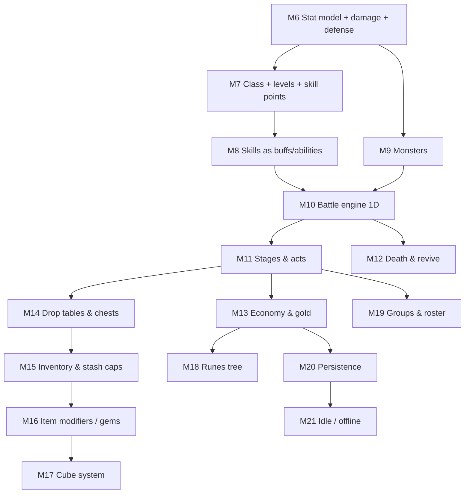

# Game Implementation Roadmap — from item core to the full auto-battler

> **Scope of this document.** A senior-engineer, dependency-ordered plan that takes the
> existing pure-domain item/stat core and grows it into the game described in
> [game-overview.md](game-overview.md). It does **not** restate the vision — read the overview
> for _what_ the game is. This doc answers _in what order we build it, and how each step stays
> SOLID, DRY, and TDD-driven without violating the locked architecture_.
>
> Each milestone below ends in **something testable** (a pure-domain assertion under Vitest),
> mirrors the format of the existing milestone plans, and references the
> [deferred-decisions-log.md](deferred-decisions-log.md) where it resolves or creates a `D-###`.

---

## ▶ Session kickoff — read this first (paste me into a new chat)

> **This file is the living source of truth for the build. Use it to resume work across chat
> sessions.** When you start a new session, paste the block below (or just attach this file and
> say _"continue the roadmap"_). The agent must follow it before writing any code.

```text
You are a senior TypeScript engineer continuing the sacerdos-io build.
Operate under .github/copilot-instructions.md (TDD, SOLID, DRY, domain purity,
inject Clock/Rng, compute-don't-store, data-not-code, log deferrals).

Do this, in order:
1. Read docs/game-implementation-roadmap.md §"Progress tracker" — it is the single
   source of truth for status. Find the milestone marked 🟡 in progress (or the first
   ⬜ if none is in progress). That is the current focus.
2. Read that milestone's step list. Re-verify reality with the codebase before trusting
   the tracker (run the tests; check the files exist). The tracker can lag behind code.
3. If §5 "Open questions" for the current milestone are unanswered, ask me before coding.
4. Work the milestone's steps TDD-first: failing test → minimal code → refactor. Do not
   skip ahead to later milestones.
5. When a step's test passes, tick its checkbox. When all of a milestone's steps pass,
   set its tracker row to ✅, flip any resolved D-### in docs/deferred-decisions-log.md,
   and append a dated entry to §"Session log" at the bottom of this file.
6. Keep edits small and verifiable. Never delete roadmap history — only append/annotate.
```

**Status legend (used throughout):** ⬜ not started · 🟡 in progress · ✅ done · ⏸️ blocked · ⏭️ deferred.

---

## 📊 Progress tracker (single source of truth)

> Update this table as the **first** thing when a milestone changes state. Everything else in
> this doc is detail; this table is the dashboard. `Tests` = the milestone's acceptance tests
> are green under `npm run test`.

**Current focus:** ✅ **M15 — Inventory & stash capacity** (done). Next up: ⬜ **M16 — Item modifiers / gems**.

| #   | Milestone                                | Phase | Status | Tests | Resolves      |
| --- | ---------------------------------------- | ----- | ------ | ----- | ------------- |
| M1  | Stats + modifiers                        | core  | ✅     | ✅    | —             |
| M2  | Items + equipment + inventory            | core  | ✅     | ✅    | —             |
| M3  | Consumables + buffs                      | core  | ✅     | ✅    | —             |
| M4  | Rarity scaling                           | core  | ✅     | ✅    | —             |
| M5  | Procedural item generation               | core  | ✅     | ✅    | —             |
| M6  | Canonical stats + damage + defense       | A     | ✅     | ✅    | sets up D-009 |
| M7  | Class + levels + skill points + passives | A     | ✅     | ✅    | D-008 (part)  |
| M8  | Skills as class-gated abilities          | A     | ✅     | ✅    | D-011         |
| M9  | Monster / enemy system                   | B     | ✅     | ✅    | D-009         |
| M10 | Battle engine (1D auto-battler)          | B     | ✅     | ✅    | —             |
| M11 | Stages, acts, difficulties, boss keys    | B     | ✅     | ✅    | D-008 (rest)  |
| M12 | Death & revive                           | B     | ✅     | ✅    | D-017 (sets)  |
| M13 | Economy & gold                           | C     | ✅     | ✅    | —             |
| M14 | Drop tables & chests                     | C     | ✅     | ✅    | D-005         |
| M15 | Inventory & stash capacity               | C     | ✅     | ✅    | —             |
| M16 | Item modifiers / gems                    | D     | ⬜     | ⬜    | D-001/002/003 |
| M17 | Cube system                              | D     | ⬜     | ⬜    | —             |
| M18 | Runes tree                               | D     | ⬜     | ⬜    | —             |
| M19 | Groups & roster                          | E     | ⬜     | ⬜    | —             |
| M20 | Persistence (save / load)                | E     | ⬜     | ⬜    | D-007         |
| M21 | Idle / offline progress                  | E     | ⬜     | ⬜    | —             |

> **Granularity rule.** This table tracks **milestone-level** status. When a milestone starts,
> author a dedicated `docs/milestone-N-plan.md` (same format as
> [milestone-5-item-generation-plan.md](milestone-5-item-generation-plan.md) /
> [milestone-6-combat-plan.md](milestone-6-combat-plan.md)) with `- [ ]` **step checkboxes** —
> that file tracks the steps; this table tracks the milestone. The `§3` summaries below are the
> seed for those plans, not a second place to duplicate step state (DRY).

---

## 0. Where we are today (verified state, June 2026)

| Area       | Built                                                                                           | Files                                                          |
| ---------- | ----------------------------------------------------------------------------------------------- | -------------------------------------------------------------- |
| Stats core | ✅ `getStat`, flat+% `computeStat`, `Character`                                                 | [stats/](../src/domain/stats)                                  |
| Effects    | ✅ `BuffTracker` (refresh stacking), `Clock`, `InstantEffect`                                   | [effects/](../src/domain/effects)                              |
| Items      | ✅ `Item`, `Equipment` (7 slots), `Inventory`, `Rarity`                                         | [items/](../src/domain/items)                                  |
| Generation | ✅ `generateItem`, `ITEM_BASES`, level curve, rarity roll                                       | [items/generate-item.ts](../src/domain/items/generate-item.ts) |
| RNG        | ✅ `Rng` contract + `SeededRng` (mulberry32)                                                    | [rng/](../src/domain/rng)                                      |
| UI         | ✅ spreadsheet shell, generate→equip→stats                                                      | [App.tsx](../src/App.tsx)                                      |
| Combat     | ⛔ planned only ([milestone-6-combat-plan.md](milestone-6-combat-plan.md)), **not implemented** | —                                                              |

Everything under `src/domain/` is React/DOM/Vite-free and unit-tested in milliseconds. The
roadmap **must preserve that**: domain stays pure, the UI stays a thin outer shell, dependencies
point inward only (UI → systems, never the reverse).

---

## 1. The pivotal decision before any combat: migrate to the canonical stat model

This is the single highest-leverage change and it **reshapes the planned Milestone 6**.

The current attribute set is the bootstrap set `HP | MP | STR | AGI | INT`. The
overview explicitly **parks** `STR/AGI/INT` and removes `MP`, and defines the _real_ combat
stats. The old M6 plan ("`STR → Attack` derived stats") is therefore **superseded**: with the
canonical model, `attack` is a _first-class stat_, not something derived from `STR`.

**What changes vs. what is reused (DRY):**

- ✅ **Reuse unchanged:** the modifier engine (`Modifier`/`ModifierSource`/`computeStat`),
  `Equipment`, `Inventory`, `BuffTracker`, `Rng`, rarity scaling, the generator's _shape_.
  These were deliberately built attribute-agnostic — the migration is mostly **data**.
- 🔁 **Reshape:** the `Attribute` union → the canonical `Stat` set; `ITEM_BASES`,
  `SEED_ITEMS`, `BASE_STATS` re-point to the new stats; the old M6 "derived stats" collapses
  into "a few **derived calculations**" (see below), not a parallel stat layer.

### Canonical stat set (v1 — from the overview)

| Stat                                                      | flat |  %  | Notes                           |
| --------------------------------------------------------- | :--: | :-: | ------------------------------- |
| `hp`                                                      |  ✅  | ✅  | combat pool surfaced as `maxHP` |
| `attack`                                                  |  ✅  | ✅  | base of the damage formula      |
| `physicalDamage`                                          |  ✅  | ✅  |                                 |
| `damage`                                                  |  —   | ✅  | global `damage%` multiplier     |
| `armor`                                                   |  ✅  | ✅  | → derived physical resist       |
| `attackSpeed`                                             |  ✅  | ✅  | attacks/sec, default 1.0        |
| `cooldownReduction`                                       |  —   | ✅  | reduces skill cooldowns         |
| `areaOfEffect`                                            |  ✅  | ✅  | skill-interpreted               |
| `blockChance`                                             |  ✅  |  —  | chance, clamped `[0,1]`         |
| `dodgeChance`                                             |  ✅  |  —  | chance, clamped `[0,1]`         |
| `damageReduction`                                         |  —   | ✅  | mitigation layer                |
| `damageAbsorption`                                        |  ✅  |  —  | flat last-layer subtract        |
| `fireResist` `coldResist` `lightningResist` `chaosResist` |  —   | ✅  | clamped, per element            |
| `fireDamage` `coldDamage` `lightningDamage` `chaosDamage` |  ✅  | ✅  | skills only for now             |

> **Design note (challenge the model):** `computeStat` today does `(base + Σflat) × Π(1+%)`.
> That is correct for `hp/attack/armor/physicalDamage`. For **chance** stats (`block`, `dodge`,
> resists) and **rate** stats (`attackSpeed`, `cdr`) the same formula still works, but the
> _interpretation_ and **clamping** differ. Rather than special-casing `computeStat`, add a
> tiny **`StatSchema`** (data: which kinds a stat accepts, its clamp range, its default). This
> keeps `computeStat` generic (Open/Closed) and moves stat-specific rules into data.

### Derived calculations that remain (small, pure, one file)

These are _formulas over canonical stats_, not a second stat system:

- `timeBetweenAttacks = 1 / getStat("attackSpeed")` (ms).
- `effectiveCooldown(baseMs) = baseMs × (1 − cooldownReduction)`.
- `physicalResist(armor)` → a simple armor→% curve (overview: "armor as an elemental resist").
- `maxHP = getStat("hp")`.

---

## 2. Architecture laws every milestone honors (do not violate)

1. **Domain purity:** new code under `src/domain/`, zero React/DOM/Vite imports.
2. **Inject time & randomness:** combat/skills/idle take a `Clock` and/or `Rng`. **No
   `Math.random()` and no wall-clock reads** in domain code. Tests pass seeded/manual versions.
3. **Compute, don't store:** stats derive on read. The only deliberately-stateful values are
   `currentHP`, buff timers, cooldown timers, and battle positions.
4. **Depend on contracts:** combat depends on a `Combatant` contract, not `Character`, so
   enemies plug in (D-009). Damage mitigation is a **pipeline of small layers** (SRP/OCP).
5. **Data, not code:** classes, skills, stages, monsters, runes, gems are **data rows**, not
   subclasses. Adding content never edits the engine.
6. **One-way deps:** `stats → effects → items → combat → battle → UI`. Nothing inner imports
   an outer layer.
7. **TDD:** failing test first, minimal pass, refactor — the step order _is_ the TDD order.
8. **Log deferrals:** when a milestone scopes something out, append a new `D-###`.

### Time unit decision (lock once)

The battle is real-time (attack speed in attacks/sec, cooldowns in **ms**, respawn in
minutes). **Lock the `Clock` unit as milliseconds.** `advance(deltaMs)` drives buffs,
cooldowns, respawns, and the battle tick. Tests call `advance(ms)` manually; the UI calls it
from a `requestAnimationFrame`/interval loop in the outer shell only.

---

## 3. Milestone roadmap (dependency-ordered)



> XP/leveling (**D-008**) is not its own milestone — it is delivered inside **M7** (the level
> curve) and **M13** (kills award XP). Each milestone names the `D-###` it resolves.

---

### Phase A — Combat foundation (1 character vs 1 enemy)

#### M6 — Canonical stats + damage formula + defense order _(supersedes the old M6 plan; resolves nothing yet, sets up D-009)_

> **Goal:** make stats _mean something_. Replace the bootstrap attributes with the canonical
> `Stat` set, implement the overview's **damage formula** and **defense/damage-taken order** as
> pure, composable functions.

- **6.1** Add `stat.ts`: the canonical `Stat` union + `STAT_SCHEMA` (data: accepted kinds,
  clamp, default). Migrate `ATTRIBUTES` consumers. _Test:_ schema invariants (every stat has a
  default; chance/resist stats clamp to `[0,1]`).
- **6.2** Migrate `BASE_STATS`, `ITEM_BASES`, `SEED_ITEMS`, `scaleItem` to canonical stats.
  _Test:_ existing equip/generate tests pass against new stats (e.g. `Short Sword` rolls
  `attack`/`physicalDamage`, not `STR`).
- **6.3** `derived.ts`: `timeBetweenAttacks`, `effectiveCooldown`, `physicalResist`, `maxHP`.
  _Test:_ anchors locked (attackSpeed 1.0 → 1000 ms; cdr 0.2 on 3000 ms → 2400 ms).
- **6.4** `damage.ts`: `computeHitDamage({attack%, physical/element flat+%, damage%}, element)`
  implementing the overview formula. _Test:_ the worked example numbers from the overview.
- **6.5** `mitigation.ts`: an **ordered pipeline** of layers — `block/dodge` (physical only) →
  `damageReduction%` → `armor`/elemental-resist → `damageAbsorption` → **floor at 1**. Each
  layer is a small pure function; the pipeline composes them (OCP: add a layer without editing
  others). _Test:_ each layer in isolation + the full order + the min-1 floor + dodge zeroes.
- **6.6** `combatant.ts` contract + `resolve-attack.ts` using injected `Rng` for block/dodge.
  _Test:_ deterministic under seed; a `+attack` weapon yields strictly more damage to a dummy.
- **6.7** UI: derived-stats panel + "attack dummy" log (thin, optional).

**Deferrals to log:** crit (overview has no crit — _remove it from the old M6 plan_), HP/sec
regen, leech, "per hit/kill" effects seen in [material-effects.md](material-effects.md) →
new `D-012` (advanced on-hit effects).

#### M7 — Class, levels, skill points, passives _(delivers part of D-008)_

> **Goal:** a `Character` gets stats from **class + level**, earns refundable skill points, and
> spends them on data-defined **passives** (a `ModifierSource`).

- **7.1** `class-def.ts` (data): per-level stat table function. Knight: `100 hp / 10 attack /
10 armor` at L1, `+10 hp / +1 attack / +3 armor` per level. _Test:_ L1 and L10 anchors.
- **7.2** `level.ts`: `baseStatsForLevel(classDef, level)` → `Record<Stat, number>`. _Test:_
  monotonic; matches table.
- **7.3** `passive-def.ts` + `PASSIVES` data (the overview list, each with per-level value &
  max). `PassiveAllocation` implements `ModifierSource`. _Test:_ "increase attack +2/level,
  max 10" → 10 levels = +20 attack via `getStat`.
- **7.4** `skill-points.ts`: grant 1/level, spend per level into passive/skill, **refund
  freely**, respect band unlocks (1–10 / 11–20 / …) and per-node caps. _Test:_ over-spend
  blocked; refund restores points; band-locked node rejected.
- **7.5** Wire `Character` base stats to come from class+level + passive source.

**Deferrals:** multiple classes (`D-013`), respec cost (overview: free for now).

#### M8 — Skills as class-gated abilities _(resolves D-011)_

> **Goal:** the four knight skills, reusing `BuffTracker` for timed effects and `Clock` for
> cooldowns. **Skill damage is a multiplier of a basic attack's final damage** — reuse M6's
> `computeHitDamage`, do not duplicate it.

- **8.1** `skill-def.ts` (data): id, band, max rank 5, cooldown ms, range tag, and a
  resolver kind (`damage` | `areaDamage` | `buff` | `debuff`). `SKILLS`: smash, shatter,
  raise-shield (sets `blockChance`→1 for N hits — a **charge-based buff**), provoke (a
  **negative** modifier `Buff` = debuff; buff/debuff share one mechanism).
- **8.2** `cooldown-tracker.ts`: per-skill timers advanced by `Clock`; `effectiveCooldown`
  applies `cdr`. _Test:_ ready→used→on-cooldown→ready after `advance`.
- **8.3** `resolve-skill.ts`: smash = `300% × basicFinalDamage`; provoke applies a
  defense-reducing debuff via `BuffTracker.apply` (negative modifiers). _Test:_ smash rank vs
  basic ratio; provoke lowers target's effective defense; raise-shield consumes charges.
- **8.4** Charge-buff extension to `BuffTracker` (or a sibling `ChargeTracker`) for
  "next N hits" with **no duration** — _challenge:_ keep it a separate small tracker rather
  than overloading the timed buff (SRP). _Test:_ N hits then expires.

**Deferrals:** enemy skill-casting (`D-014`, overview hints fireball/cold-bolt later); concrete
skill _ranges_ ("tested live" — `D-015`).

---

### Phase B — The auto-battler

#### M9 — Monster / enemy system _(resolves D-009)_

> **Goal:** a `Monster` that **implements `Combatant`**, with canonical stats scaled by a
> stage's monster level and an act's allowed elements.

- **9.1** `monster-def.ts` (data) + `monster-bases.ts`. `scaleMonster(base, level, rng)`
  reusing the level curve idea. _Test:_ deterministic stat scaling; act-1 monsters deal
  physical only, act-2 may deal fire.
- **9.2** Boss = monster with a stat multiplier (overview: "stage boss is a normal monster with
  higher stats"). _Test:_ boss stats = base × multiplier.

#### M10 — Battle engine (1D linear auto-battler)

> **Goal:** the core loop. A `Clock`-driven tick advances a one-dimensional battlefield:
> characters move left-to-engage, monsters spawn off-screen and move right, **front-to-back
> targeting**, range checks, automatic basic attacks + skill use, win when waves cleared / lose
> when the group dies. No collision system — just leftmost-character and rightmost-monster
> limits, exactly as the overview specifies.

- **10.1** `battlefield.ts`: positions on a line; `frontMostEnemy(of side)`; movement toward
  range. _Test:_ a melee unit closes distance; a ranged unit stops at its range.
- **10.2** `battle.ts`: `tick(deltaMs)` advances cooldowns, attack timers (`timeBetweenAttacks`),
  movement, and resolves attacks/skills via M6/M8. Pure; takes `Clock` + `Rng`. _Test
  (deterministic):_ scripted seed → identical blow-by-blow; group clears a 1-monster wave;
  group wipes vs an overtuned monster.
- **10.3** Wave/stage runner: sequential waves → stage boss. _Test:_ N waves then boss; same
  stage always yields the same monster count (overview: fixed reward).
- **10.4** UI: a minimal real-time view driving `tick` from the outer loop.

**Deferrals:** positioning/formation UI polish, projectile visuals, juice (`D-016`).

#### M11 — Stages, acts, difficulties, boss keys _(delivers rest of D-008)_

> **Goal:** content structure. 2 acts × 9 stages + act-boss, 2 difficulties (normal/hard),
> per-stage monster/item level, unlock & progression rules, **boss keys** (consumed only if the
> act boss drops loot).

- **11.1** `stage-def.ts` / `act-def.ts` (data): waves, monster counts, monster level, item
  level, allowed elements, gold/xp baseline. _Test:_ act-1 = physical; act-2 adds fire; hard
  raises item level.
- **11.2** `progression.ts`: latest-stage advance/retreat rules, hard unlock after final act
  boss, difficulty lock/visible. _Test:_ clear→advance; wipe→down one (never below 1-1);
  hard locked until normal cleared.
- **11.3** `boss-key.ts`: a non-stackable `misc` item gating the act-boss; consumed only on a
  boss drop. _Test:_ key kept when nothing drops; consumed when something drops.
- **11.4** XP award on kill, split among **living** characters. _Test:_ dead char earns none.

#### M12 — Death & revive

> **Goal:** per-stage revive, in-stage respawn timer (Clock), placeholder paid instant revive.

- **12.1** `respawn.ts`: 2-min base timer, reducible by flat+% (rune hooks later). _Test:_
  timer counts down via `advance`; char returns at 0.
- **12.2** Revive-all at stage start. _Test:_ entering a stage restores the group.
- **12.3** Paid instant-revive **placeholder** cost formula. _Deferral_ `D-017` (revive cost
  balancing).

---

### Phase C — Economy & loot loop

#### M13 — Economy & gold

> **Goal:** a `Wallet`; gold per kill scaling by stage and source (monster / stage boss /
> act boss), each separately rune-modifiable later.

- **13.1** `gold.ts`: `goldForKill(source, stageLevel, modifiers)`. _Test:_ act-1-1 monster = 1,
  boss = 10×; endgame anchors from the overview.
- **13.2** `wallet.ts`: add/spend, never negative. _Test:_ spend > balance rejected.

#### M14 — Drop tables & chests _(resolves D-005)_

> **Goal:** kills/bosses roll chests; chests roll items via `generateItem`. The overview's
> first-chest table is the first concrete drop table; **first weapon drop is 100%** for the
> class.

- **14.1** `chest-def.ts` + `drop-table.ts`: weighted rarity/type rolls via `Rng`. _Test:_
  seeded roll reproduces the overview's grade odds within tolerance; first drop is the class
  weapon.
- **14.2** `chest-inventory.ts`: capacity-capped chest store; open requires inventory space.
  _Test:_ full → no more chests; open blocked when inventory full.

#### M15 — Inventory & stash capacity _(reuses Inventory; resolves part of D-007 prep)_

> **Goal:** apply the overview's **capacity limitation**. **Reuse `Inventory`** for inventory,
> stash tabs, and (constrained) equipment — DRY. Add capacity + stacking rules; full inventory
> ⇒ dropped loot is **lost**.

- **15.1** Generalize `Inventory` with a capacity and stacking policy (misc stacks; modifiers /
  boss keys do not). _Test:_ stack misc; modifier consumes its own slot; cap enforced.
- **15.2** `stash.ts`: multi-tab over the same `Inventory` abstraction; move items inventory↔
  stash. _Test:_ move respects both capacities.

---

### Phase D — Crafting & progression systems

#### M16 — Item modifiers / gems (decoration / engraving / inscription) _(advances D-001/D-002/D-003)_

> **Goal:** socketable stat-granting materials. Slot **count & types by rarity** (overview
> table). Materials are data ([material-effects.md](material-effects.md)); applying one adds a
> `Modifier` source to the equip; extraction removes it.

- **16.1** `socket.ts`: per-item sockets by rarity; `applyMaterial` / `extract`. A socketed
  equip aggregates its base + material modifiers (still one `ModifierSource`). _Test:_ rare = 1
  type-1 slot; legendary = 2; applying Minor Ruby adds its stat; extraction removes it.
- **16.2** Material data rows + roll ranges (this is where **D-002 value ranges** land). _Test:_
  seeded roll within the material's `min~max`.

#### M17 — Cube system _(resolves D-005 sibling; see [cube.md](cube.md))_

> **Goal:** synthesis (recycle same-rarity → next, **fresh roll** output), alchemy (sell for
> gold), cube leveling via consumed-item EXP, tier thresholds gating eligible item levels.
> Crafting stays **deferred**.

- **17.1** `synthesis.ts`: N-of-same-rarity → 1 higher (start 3-to-1, perk-tunable). Type must
  match (equip→equip, etc.); threshold blocks out-of-range item levels. _Test:_ 3 commons →
  1 fresh uncommon; mismatched type/level rejected.
- **17.2** `alchemy.ts`: sell value table from the overview. _Test:_ L1 common = 10g; L10
  legendary = 6750g.
- **17.3** `cube-exp.ts`: EXP per consumed item per [cube.md](cube.md) formula; level unlocks.
  _Test:_ EXP formula anchors; level-gated operations locked until unlocked.

**Deferral:** crafting/offering/inscription-as-cube-op (`D-018`).

#### M18 — Runes tree (account-wide buffs)

> **Goal:** a gold sink that grants **account-level** modifiers layered above the character —
> another `ModifierSource`, plus non-stat perks (inventory cap, stash tabs, respawn reduction,
> drop/gold/exp gains). Tree of nodes with per-level cost; no prerequisites (overview).

- **18.1** `rune-node.ts` + `RUNE_TREE` data; `RuneState` (levels) implements `ModifierSource`
  for stat nodes and exposes typed getters for non-stat perks. _Test:_ buying a node raises the
  global stat / perk; cost scales with branch depth & level.
- **18.2** Wire rune perks into existing hooks: gold (M13), drops (M14), inventory cap (M15),
  respawn (M12), cube exp (M17). _Test:_ each hook reads the rune value.

---

### Phase E — Roster, persistence, idle

#### M19 — Groups & character roster

> **Goal:** multiple characters, a group with a player-ordered formation, default 1 group /
> 3 character slots, expandable later. Acquisition currency is a **placeholder** (overview
> defers it).

- **19.1** `roster.ts` (owned characters) + `group.ts` (ordered formation feeding M10). _Test:_
  formation order drives battle positions; slot caps enforced.

**Deferral:** second currency, character/group shop (`D-019`).

#### M20 — Persistence (save / load) _(resolves D-007)_

> **Goal:** serialize roster, equipment, inventory/stash, wallet, runes, cube level, progression.
> Keep serialization **outside** the domain (a mapper in the shell) so domain stays pure.

- **20.1** `serialize.ts` mapper (outer layer): pure DTO ↔ domain. _Test:_ round-trip equality
  of a populated state.

#### M21 — Idle / offline progress

> **Goal:** on return, compute elapsed real time and fast-forward farming on the current stage
> via the **same `Clock`/battle tick** — no parallel simulation (DRY).

- **21.1** `offline.ts`: `simulateElapsed(state, deltaMs)` batching ticks/kills into gold + xp +
  chest rolls, capped by inventory space and an offline ceiling. _Test:_ deterministic rewards
  for a fixed elapsed time + seed.

---

## 4. New deferrals to record when reached

When each milestone begins, append these to [deferred-decisions-log.md](deferred-decisions-log.md):

| ID    | Title                                                   | Surfaces in |
| ----- | ------------------------------------------------------- | ----------- |
| D-012 | Advanced on-hit effects (regen, leech, per-hit/kill HP) | M6          |
| D-013 | Additional classes beyond Knight                        | M7          |
| D-014 | Enemy skill-casting (fireball / cold-bolt)              | M8          |
| D-015 | Concrete skill ranges ("tune live")                     | M8          |
| D-016 | Battle visuals / formation UI / juice                   | M10         |
| D-017 | Paid-revive cost balancing                              | M12         |
| D-018 | Cube crafting / offering / inscription op               | M17         |
| D-019 | Second currency + character/group shop                  | M19         |

> Existing log entries resolved by this roadmap: **D-009** (M9), **D-011** (M8), **D-005**
> (M14/M17), **D-007** (M20), **D-008** (M7+M11). **D-001/D-002/D-003** advance in M16.

---

## 5. Open questions to confirm before M6

1. **Stat migration blast radius.** M6.2 re-points `ITEM_BASES`/`SEED_ITEMS`/`BASE_STATS`. Do
   we migrate in place (rename the union, update data) or keep `STR/AGI/INT` as dead aliases?
   _Recommendation:_ migrate in place; the overview parks them, so dead aliases are debt.
2. **`computeStat` for chance/rate stats.** Confirm the `StatSchema` clamp approach (§1) over
   special-casing — keeps the engine Open/Closed.
3. **Armor → physical-resist curve.** The overview says "simple formula for now." Lock one
   anchor (e.g. `resist = armor / (armor + K)`), pick `K`, document it.
4. **Skill-damage definition.** Confirm "% of a basic attack's _final_ damage" reads M6's
   `computeHitDamage` output (so gear/percent buffs flow through skills automatically).

---

## 6. Session log (append-only)

> One short entry per working session. **Append to the top** (newest first). Never edit past
> entries. Each entry: date, the milestone/steps touched, the resulting tracker change, and the
> **next action** so the following session can resume in one read. Keep it to a few lines.

**Template (copy for a new entry):**

```md
### YYYY-MM-DD — <milestone> <short title>

- **Did:** <what shipped — files added, tests now green>.
- **Tracker change:** <e.g. M6 ⬜→🟡, steps 6.1–6.3 done>.
- **Deferrals:** <new D-### appended, or none>.
- **Next action:** <the very next step a fresh session should pick up>.
```

<!-- Newest entries on top -->

### 2026-06-22 — M15 Inventory & stash capacity (complete)

- **Did:** generalized `src/domain/items/inventory.ts` in place (TDD-first) with an optional
  `capacity` (default `Infinity` = unlimited, so the UI's `new Inventory()` and every existing
  test are unchanged) and a `StackPolicy` (`DEFAULT_STACK_POLICY` stacks `kind === "misc"`;
  equippables / consumables / modifiers / boss keys each take their own slot). Slots are
  **computed, not stored** (`stacks` groups stackable items by id; `slotsUsed` = stacks length).
  Added `hasSpace()` (item-agnostic `LootSink` contract), `canAccept(item)` (item-aware: a
  stackable item joins an existing same-id stack even when full), and `add` now returns a boolean
  (false + no mutation when no room). `Inventory` structurally satisfies M14's `LootSink` without
  importing `loot` (one-way deps preserved). Added `stash.ts`: `Stash` = ordered `Inventory`
  tabs (starts ≥1) + free `moveItem(from, to, item)` (atomic — verifies `to.canAccept` before
  mutating `from`; works inventory↔tab and tab↔tab). Headline tests green: two identical misc
  items → 1 slot (count 2); distinct ids → own slots; cap blocks the (n+1)-th distinct item;
  move respects both source presence and destination capacity/stacking. **369 tests green (+17);
  lint + build pass.**
- **Tracker change:** M15 ⬜→✅ (Status + Tests); steps 15.1–15.2 ticked. Plan:
  `docs/milestone-15-plan.md`.
- **Deferrals:** none new logged in the D-### log. Plan §3 notes punted in-doc: unbounded misc
  stacks (no per-item `maxStack` yet), capacity-growth source (rune tree, M18), and
  equipment-as-`Inventory` unification (stays with the `Equipment` class for now, revisit at M20).
- **Next action:** start **M16 — Item modifiers / gems**: author `docs/milestone-16-*.md`;
  `socket.ts` (per-item sockets by rarity — rare = 1 type-1 slot, legendary = 2; `applyMaterial` /
  `extract` aggregate as one `ModifierSource`) then material data rows + seeded roll ranges
  (advances D-001/D-002/D-003).

- **Did:** added the pure-domain `src/domain/loot/` module TDD-first (imports `items` + `rng`;
  nothing inner imports it). Refactored `generate-item.ts` to take **optional** `base`/`rarity`
  in `GenerateOptions` (forced base/rarity bypass the internal rolls; with neither, rng call
  order is byte-for-byte identical — snapshot + all existing tests unchanged). `drop-table.ts`
  (`ItemCategory` = weapon/armor/accessory via `categoryForSlot`; `DropTable` data =
  `rarityWeights` + `categoryWeights`; generic `weightedPick` banding like `rollRarity`;
  `rollDrop` = roll rarity → category → pick eligible base → `generateItem(forced)`). `chest-def.ts`
  (`ChestTier` common/rare/legendary; `Chest {tier, guaranteedBaseId?}`; `COMMON_CHEST_TABLE`
  carries the overview's first-chest grade odds 78/20.6/1.37; `firstChest(weaponBaseId)` →
  guaranteed-class-weapon chest; `openChest` forces base@Common when guaranteed, else rolls tier
  table). `chest-inventory.ts` (`LootSink` contract — decoupled from M15's capped `Inventory`;
  `ChestInventory` capacity-capped: `add` returns false when full, `open` throws when sink full /
  index OOR, else routes item to sink + removes chest). Headline tests green: 100k-roll grade
  odds within tolerance; first drop always the class weapon; full store rejects chests; open
  blocked when sink full. **352 tests green (+26); lint + build pass.**
- **Tracker change:** M14 ⬜→✅ (Status + Tests); steps 14.0–14.2 ticked. Plan:
  `docs/milestone-14-drops-plan.md`. Resolved D-005.
- **Deferrals:** none new. D-005 tuning notes (per-source chest drop chances, first-chest 16%
  gate, rare/legendary grade odds) folded under existing D-026 / rune drop-rate work (M18).
- **Next action:** start **M15 — Inventory & stash capacity**: author `docs/milestone-15-*.md`;
  generalize `Inventory` with capacity + stacking policy (misc stacks; modifiers / boss keys do
  not), then `stash.ts` multi-tab over the same abstraction; wire `Inventory` to satisfy the
  `LootSink` contract introduced in M14.

### 2026-06-21 — M13 Economy & gold (complete)

- **Did:** added the pure-domain `src/domain/economy/` module TDD-first (imports **nothing** from
  other domain modules; nothing inner imports it). `gold.ts` (`GoldSource` =
  `weakMonster`/`strongMonster`/`stageBoss`/`actBoss` — its **own** enum, distinct from XP's
  `KillSource`, because gold splits weak vs strong; `BASE_GOLD` data 1/2/10/50;
  `goldForKill(source, stageLevel, {flat,percent})` = `floor((base×stageLevel + flat)×(1+percent))`,
  flat-then-percent like the stat engine; validates `stageLevel` int ≥ 1). `wallet.ts` (`Wallet`:
  `balance` never negative; `add`/`spend`/`canAfford`; `spend` over balance **throws** and leaves
  balance unchanged; non-negative finite amounts only). Headline tests green: act-1-1 weak = 1,
  stage boss = 10×, strong = 2× weak, act boss = 50; linear stage scaling; spend > balance
  rejected. **326 tests green (+18); lint + build pass.**
- **Tracker change:** M13 ⬜→✅ (Status + Tests); steps 13.1–13.2 ticked. Plan:
  `docs/milestone-13-economy-plan.md`.
- **Deferrals:** D-026 (gold scaling / balance curve) appended — base values + linear scaling are
  placeholders; endgame 1k/2k anchors need rune-tree (M18) + stage spread to tune against.
- **Next action:** start **M14 — Drop tables & chests** (resolves D-005): author
  `docs/milestone-14-*.md`; `chest-def.ts` + `drop-table.ts` (weighted rarity/type rolls via
  `Rng`, first class-weapon drop 100%) then `chest-inventory.ts` (capacity-capped store).

### 2026-06-21 — M12 Death & revive (complete)

- **Did:** added the pure-domain `src/domain/revive/` module TDD-first (imports `clock` only;
  nothing inner imports it; works against a minimal `Revivable` contract, never the concrete
  `Character`/`Monster`). `tuning.ts` (`BASE_RESPAWN_MS=120_000`, `MIN_RESPAWN_MS=0`, instant-
  revive placeholder constants). `respawn.ts` (`Revivable {currentHP, revive()}`; `isDowned` =
  `currentHP<=0`; `effectiveRespawnMs({flatMs,percent})` = `(BASE−flat)×(1−percent)` floored at 0,
  same flat-then-percent order as the stat engine; `RespawnQueue implements Clock` — `down`
  (idempotent), `isPending`/`remainingFor`/`pendingCount`, `advance` decrements & at ≤0 calls
  `revive()` + dequeues). `revive-all.ts` (`reviveAll(members)` full-restores the whole group).
  `revive-cost.ts` (`instantReviveCost(level)` = `50 + 10×(L−1)` placeholder, D-017). Added a
  one-line `Character.revive()` (restore `currentHP`→`maxHP`) so the real group type satisfies
  `Revivable`. Headline tests green: timer counts down via `advance` and revives at 0; reduction
  shortens it; revive-all restores dead + hurt members; idempotent `down`. **308 tests green
  (+14); lint + build pass.**
- **Tracker change:** M12 ⬜→✅ (Status + Tests); steps 12.1–12.3 ticked. Plan:
  `docs/milestone-12-revive-plan.md`.
- **Deferrals:** D-017 (paid-revive cost balancing) logged — the cost formula is a placeholder.
- **Next action:** start **M13 — Economy & gold**: author `docs/milestone-13-*.md`; `gold.ts`
  (`goldForKill(source, stageLevel, modifiers)` — act-1-1 monster = 1, boss = 10×) then
  `wallet.ts` (add/spend, never negative).

### 2026-06-21 — M11 Stages, acts, difficulties, boss keys (complete)

- **Did:** added the pure-domain `src/domain/stages/` module TDD-first (imports `monsters` +
  `combat` only; nothing inner imports it). `difficulty.ts` (`normal`/`hard`; hard locked,
  `+10` item & monster level — elements stay act-sourced, D-025). `stage-def.ts` (`StageDef`
  `waveSizes`/`monsterId`/`bossId`/`monsterLevel`/`itemLevel`/rewards + `ActBossDef`).
  `act-def.ts` (`buildAct` expands a compact `ActTuning` into 9 ramped stages; `ACTS` = act 1
  physical, act 2 +fire; `actByIndex`/`stageAt` throw out of range). `build-waves.ts`
  (`buildStageWaves` = regular waves + a final `scaleBoss` stage-boss wave; `buildActBossWaves`;
  `stageItemLevel`/`stageMonsterLevel` = base + difficulty bonus) — **this is the seam that
  produces the `Monster[][]` the M10 `StageRunner` already consumes**. `progression.ts`
  (`advance`/`retreat` clamped to `[act1 s1, lastAct s9]`, act-chaining; `isFinalStage`;
  `isDifficultyUnlocked`). `boss-key.ts` (`BossKey{actIndex}`; `settleBossKeyAfterFight` consumes
  one key iff the boss dropped loot). `xp.ts` (`xpForKill` per-source; `splitXpAmongLiving` =
  equal floor share to the living, **0 to the dead**; placeholder triangular `levelForTotalXp`).
  Headline tests green: act 1 physical / act-2 stage boss fire; hard raises item+monster level;
  fixed monster count per stage; clear advances / wipe retreats (floor at 1-1); hard locked until
  normal final boss; dead member earns no XP. **294 tests green (+37); lint + build pass.**
- **Tracker change:** M11 ⬜→✅ (Status + Tests); steps 11.1–11.7 ticked. Plan:
  `docs/milestone-11-stages-plan.md`. Delivered the rest of D-008 (kills award XP).
- **Deferrals:** D-024 (XP→level curve balancing), D-025 (per-difficulty extra elements) appended.
- **Next action:** start **M12 — Death & revive**: author `docs/milestone-12-*.md`; `respawn.ts`
  (2-min `Clock`-driven timer, flat+% reducible), revive-all at stage start, placeholder paid
  instant-revive cost (D-017).

### 2026-06-21 — M10 Battle engine (1D auto-battler) (complete)

- **Did:** added the pure-domain `src/domain/battle/` module TDD-first (imports combat + skills +
  monsters + clock + rng; nothing inner imports it). `tuning.ts` (all battle constants in one
  place: `MOVE_SPEED`, `BASIC_ATTACK_RANGE`, `SKILL_RANGE` placeholders, spawn positions).
  `battlefield.ts` (pure geometry: `advanceDirection`, `distance`, `stepFor`, `frontMost` =
  party-min-x / enemy-max-x, `approach` = move toward a target but stop `range` short, never
  overshoot). `battle-unit.ts` (`BattleUnit` wraps a `Combatant` with side/x/attack-timer/
  engageRange/`attackElement`/skill loadout/`CooldownTracker`). `battle.ts` (`Battle implements
Clock`; locked `tick`: cooldowns → move party then enemies → act (skills before basics) → status;
  front-to-back focus fire; basic attacks paced by `timeBetweenAttacks` via `Rng`; auto-casts
  damage/areaDamage skills, areaDamage fans out to all foes in radius). `stage-runner.ts`
  (`StageRunner implements Clock`: persistent party through ordered `Monster[]` waves → boss =
  last wave; `cleared`/`wiped`; party HP persists across waves; decoupled from M11's stage schema).
  Headline tests green: melee closes / ranged stops at range; same seed → identical HP trace;
  party clears a 1-monster wave; party wipes vs an overtuned monster; N waves then boss →
  `cleared` with fixed monster count. **257 tests green (+25); lint + build pass.**
- **Tracker change:** M10 ⬜→✅ (Status + Tests); steps 10.1–10.3 ticked. Plan:
  `docs/milestone-10-battle-plan.md`. (UI step 10.4 left to the outer shell — D-016.)
- **Deferrals:** D-016 (battle visuals/UI), D-022 (per-unit/stat movement speed), D-023
  (buff/debuff skills applied in-battle) appended. Note: the ×3 boss multiplier is brutal under
  the multiplicative damage formula — a balance concern for M11, not an engine bug.
- **Next action:** start **M11 — Stages, acts, difficulties, boss keys**: author
  `docs/milestone-11-*.md`; `stage-def.ts`/`act-def.ts` (data) _producing_ the `Monster[]` waves
  the `StageRunner` already consumes; `progression.ts`; `boss-key.ts`; XP-on-kill (rest of D-008).

### 2026-06-21 — M9 Monster / enemy system (complete)

- **Did:** added the pure-domain `src/domain/monsters/` module TDD-first (imports `combat` +
  `stats` only; nothing inner imports it). `monster-def.ts` (`MonsterDef`/`MonsterStatBlock`
  data rows), `monster-bases.ts` (`MONSTER_BASES` = weak `goblin-grunt`, strong `orc-brute`,
  boss-flavoured `ogre-warlord`; `monsterById` throws on unknown), `scale-monster.ts`
  (`Monster implements Combatant` like `TrainingDummy`; `scaleMonster(def, level,
allowedElements, {statMultiplier})` = `floor((base + perLevel·(L−1))·mult)`, deterministic, no
  rng). Element resolves to the monster's `preferredElement` **if** the act's `allowedElements`
  permits it, else `physical`; `flatDamage` is routed into `ELEMENT_DAMAGE_STAT[element]`, so the
  same `ogre-warlord` deals physical in act 1 and fire in act 2. `scaleBoss` =
  `BOSS_STAT_MULTIPLIER` (3×) applied before the floor. Confirmed with design: two normals + one
  boss archetype; linear per-monster gains; deterministic (variance → D-021); element via
  `allowedElements`. **232 tests green (+12); lint + build pass.** Headline test: the scaled
  monster works as a `resolveAttack` attacker/defender and boss stats = normal × 3.
- **Tracker change:** M9 ⬜→✅ (Status + Tests); steps 9.1–9.2 ticked. Plan:
  `docs/milestone-9-monsters-plan.md`.
- **Deferrals:** D-021 (monster stat variance) appended; D-009 resolved.
- **Next action:** start **M10 — Battle engine (1D auto-battler)**: author
  `docs/milestone-10-*.md`; `battlefield.ts` (1D positions, front-most targeting, movement toward
  range) then `battle.ts` (`tick(deltaMs)` driving cooldowns/attack timers via M6/M8, `Clock`+`Rng`).

- **Did:** added the pure-domain `src/domain/skills/` module TDD-first (sits above
  combat + character + effects; nothing inner imports it). `skill-def.ts` merges combat data
  (`kind`, `cooldownMs`, `range`, `element`, per-rank `values`) onto M7's `KNIGHT_SKILL_NODES`
  so band/maxRank stay single-sourced — `KNIGHT_SKILLS` = smash (damage 200–400%), shatter
  (areaDamage 100–200%), raise-shield (buff, 3–7 charges), provoke (debuff, −0.20…−0.60
  `damageReduction`); all 3 s cd. `cooldown-tracker.ts` (`CooldownTracker implements Clock`,
  `effectiveCooldown`-aware, ms). `charge-tracker.ts` (`ChargeTracker implements ModifierSource`
  for "next N hits", SRP sibling of `BuffTracker`). `resolve-skill.ts` reuses M6 by extracting an
  exported `basicHitDamage` from `resolveAttack`: `resolveSkillDamage` = multiplier × mitigated
  basic; `resolveDebuff` applies a permanent (`duration: Infinity`) `BuffTracker` debuff;
  `resolveBuff` applies the charge buff (flat `+1` blockChance, clamped to 1). Confirmed with
  design: provoke → generic `damageReduction`; ChargeTracker for raise-shield + BuffTracker
  ∞ for provoke; shatter single-target now. **220 tests green (+28); lint + build pass.**
- **Tracker change:** M8 ⬜→✅ (Status + Tests); steps 8.1–8.4 all ticked.
- **Deferrals:** D-014 (enemy skill-casting) and D-015 (concrete skill ranges) appended; D-011
  resolved.
- **Next action:** start **M9 — Monster / enemy system**: author `docs/milestone-9-*.md`; a
  `Monster` implements the `Combatant` contract with canonical stats scaled by stage level.

### 2026-06-21 — M7 Class + levels + skill points + passives (complete)

- **Did:** added the pure-domain `src/domain/character/` module TDD-first: `class-def.ts`
  (`KNIGHT` per-level stat table), `level.ts` (`baseStatsForLevel` = base + gain·(L−1)),
  `choice-node.ts` (shared `Band`/`ChoiceNode` + band-unlock helpers), `passive-def.ts`
  (7 Knight passives as data, 2/2/2/1 band split; `PassiveAllocation` is a `ModifierSource`),
  `skill-node.ts` (4 skills registered as band-gated rank-5 nodes; effects deferred to M8),
  `skill-points.ts` (`Build`: 1 point/level, spend/refund freely, band-unlock + max-rank +
  budget enforcement; itself a live `ModifierSource`), and `create-character.ts`
  (`createCharacter` composes class+level base stats + the build + extra sources). Confirmed
  with design: explicit band fields, 2/2/2/1 passive split, 1 skill/band, elem-resist passive
  hits all 4 resists. **192 tests green (+35); lint + build pass.**
- **Tracker change:** M7 🟡→✅ (Status + Tests); steps 7.1–7.5 all ticked.
- **Deferrals:** D-013 (additional classes) and D-020 (respec cost) appended. D-008 partially
  delivered (level → base-stat curve); XP earning still pending (M11).
- **Next action:** start **M8 — Skills as class-gated abilities**: author
  `docs/milestone-8-*.md`, reuse `KNIGHT_SKILL_NODES` + `BuffTracker` + `computeHitDamage`.

### 2026-06-21 — M6 Canonical stats + damage + defense (complete)

- **Did:** migrated the bootstrap attributes to the canonical `Stat` set + data-driven
  `STAT_SCHEMA` (`stat.ts`), deleted `STR/AGI/INT/MP`, re-pointed all item/seed/UI data and
  tests, regenerated the `generateItem` snapshot. Built the `combat/` subsystem TDD-first:
  `derived.ts` (timing/resist/maxHP), `damage.ts` (`computeHitDamage`), `mitigation.ts`
  (reduction→armor/resist→absorption→min-1 floor), `combatant.ts` (`Combatant` + `asCombatant`),
  `training-dummy.ts`, `resolve-attack.ts` (dodge→block→mitigate, locked rng order). Added a
  Combat panel (derived stats + Attack/Reset Dummy + log) to `App.tsx`. Fixed a pre-existing
  `erasableSyntaxOnly` build break in `buff.ts`. **157 tests green; lint + build pass.** Headline
  test proves a `+attack` weapon strictly increases damage dealt under a fixed seed.
- **Tracker change:** M6 🟡→✅ (Status + Tests); steps 6.1–6.7 all ticked.
- **Deferrals:** D-012 (advanced on-hit effects) logged; crit dropped (overview has no crit, not deferred).
- **Next action:** start **M7 — Class + levels + skill points + passives**: author
  `docs/milestone-7-*.md` and confirm any open questions before coding.

### 2026-06-21 — Roadmap authored (M1–M5 already shipped)

- **Did:** drafted this roadmap (§0–§5) mapping the full [game-overview.md](game-overview.md)
  onto the existing pure-domain core; added the session-kickoff prompt, the progress tracker,
  and this log.
- **Tracker change:** baselined M1–M5 as ✅ (verified in code); M6–M21 as ⬜.
- **Deferrals:** none yet (D-012–D-019 are pre-registered in §4, to append when each milestone
  starts).
- **Next action:** confirm §5 open questions 1–3, then start **M6** by authoring
  `docs/milestone-6-combat-plan.md` and writing `stat.ts` test-first (step 6.1).

---

> _Keep this roadmap current: when a milestone lands, mark it ✅ in the tracker and flip the
> matching `D-###` Status in the deferred-decisions log. Never delete history — only
> append/annotate._
