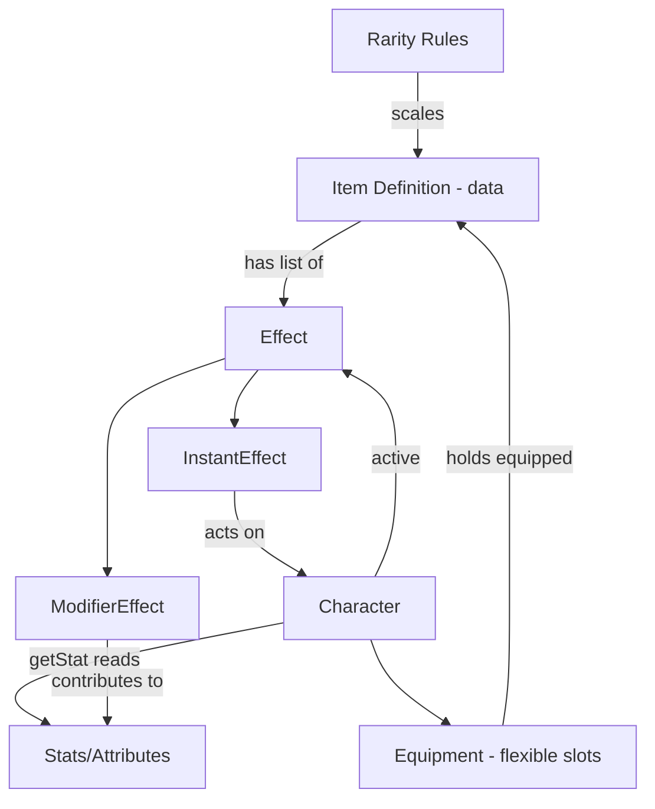

# Game System Plan — Items & Character

> Scope of this document: **Items and how they interact with a Character.**
> Heroes/enemies/quests/skills/levels as standalone systems are intentionally deferred.
> Goal: maximum reusability, SOLID-friendly, and _something testable fast_.

---

## 1. Guiding principles

- **Data, not code, defines content.** A new item or consumable should be a data entry, not a new class. Designers add content without touching the engine.
- **Behavior is composed, not inherited.** Avoid deep class trees (`HealthPotion extends Consumable extends Item`). Instead, an item _has_ a list of small behaviors.
- **Systems talk through small contracts (interfaces), not concrete types.** This is where SOLID lives.
- **Compute, don't duplicate.** Final stats are derived from sources on demand, so there is a single source of truth.
- **Stay testable.** Every milestone below ends in a runnable assertion.

---

## 2. The core idea: everything an item "does" is an **Effect**

You described:

- `heal(10)`
- `skill(INCREASE_AGILITY)`
- equips that add base attributes + modifiers

**Challenge to your assumption:** consumables and equipment look like two different things, but they are the same thing — _a bundle of effects_. The only difference is **when** the effects apply:

| Item kind  | When effects apply                         | When they stop                                     |
| ---------- | ------------------------------------------ | -------------------------------------------------- |
| Consumable | Instantly on "use", and/or triggers a Buff | Instant: immediately. Buff: when its timer expires |
| Equippable | While equipped                             | When unequipped                                    |
| Misc       | Never (no effects)                         | —                                                  |

So we don't need 3 different item systems. We need **one item that holds effects** and **one rule for when effects are active** (instant, while-equipped, or timed-buff).

### Effect types (start with these three)

1. **InstantEffect** — happens once (e.g. `Heal 10`).
2. **ModifierEffect** — changes a stat while active (e.g. `+5 Agility`, `+10% Attack`).
3. **Buff** — a _named, timed_ bundle of `ModifierEffect`s that applies, runs for a duration, then expires.

`skill(INCREASE_AGILITY)` is a **Buff**: it applies modifier effects, lasts a set time, then removes them automatically.

**Why a Buff is its own data entity (not tied to the item):**
The same buff can be triggered from many sources — a potion, a special item, or a class ability (e.g. a Priest's blessing). So a Buff is defined once as data, and an item/skill simply _references_ it. This is what makes "skills" emerge for free: a class skill is just "this class can apply Buff X."

```
Item/Skill  --triggers-->  Buff (id, duration, list of ModifierEffects)
                                 |
                                 v applies its effects for `duration`, then removes them
                              Character active-effects
```

- **Source-agnostic:** a Buff doesn't care if it came from a potion or a Priest.
- **Stacking is a Buff property** (refresh / stack / ignore — see open question 5), decided per buff, not per item.

---

## 3. Character stats: computed on demand (recommended)

A character's **final** attribute is never stored as one number. It is calculated from layers:

```
Final stat = (Base from class + level growth)
            + sum(flat modifiers from equipped items)
            + sum(flat modifiers from active temporary effects)
   then    * product(percentage modifiers)
```

- **Single source of truth:** there is no "current agility" field to keep in sync. Equip an item → recompute → done.
- **Order matters:** apply all _flat_ modifiers first, then _percentage_ modifiers. (A common bug source — decide this once, here.)
- For performance later you can cache the result and invalidate on change. **Don't build the cache yet** — premature.

---

## 4. The systems you actually need (kept minimal)

Each is small and depends only on interfaces, not on each other's internals.

1. **Stats / Attributes**
   - Defines what an attribute is. v1 set: `HP`, `MP`, `STR`, `AGI`, `INT`.
   - Knows nothing about items.

2. **Effect system**
   - `Effect` contract with `apply` / `remove` (or `compute contribution`).
   - `InstantEffect`, `ModifierEffect` (flat + percentage), `Buff` (timed, refresh-on-reapply).
   - Depends on a `Clock` for buff durations. Knows about a "stat target," nothing about items.

3. **Item definitions (data)**
   - An item = id, name, rarity, kind (consumable / equippable / misc), level requirement, and a list of effects.
   - Equip-specific data (slot, base attributes) lives here too.
   - Pure data. No behavior.

4. **Rarity rules**
   - Rarity tier index → multiplier (Common 1× … Legendary 5×) that scales an equip's base attributes and modifiers.
   - A small lookup table. Keeps "how good is this item" out of the item itself, and is re-tunable in one place.

5. **Equipment / Inventory (flexible slots — per your choice)**
   - Slots are **defined by data**, not hardcoded. A slot is an id + accepted item tag(s) + capacity.
   - v1 slots (locked): `weapon`, `helm`, `body`, `gloves`, `boots`, `ring`, `amulet` (7 single-capacity slots).
   - This lets you add "ring x2", "trinket", "cosmetic" later without code changes.
   - Equipment = "which items are currently in which slots."
   - **Inventory:** the simplest possible list of owned items (tap to equip). Behind a small `Inventory` interface so it can be enhanced later (sorting, filtering, stacks) without touching callers.

6. **RNG (seedable, injected)**
   - A `Rng` contract (e.g. `nextInt(min, max)`, `nextFloat()`) — never call `Math.random()` directly in domain code.
   - Injected like `Clock`: production passes a real seeded RNG; tests pass a deterministic seeded RNG so generated content is assertable.
   - Item _generation_ rules are deferred, but the RNG seam is built now so generation can be added later without rework.

7. **Character**
   - Holds base stats (from class + level), an equipment set, and active temporary effects.
   - Exposes `getStat(attribute)` which runs the computation in §3.
   - Exposes `use(item)` → applies the item's instant effects (and adds timed ones).

> Notice **Character depends on interfaces** (Effect, EquipmentSet, StatProvider), so each system stays detachable and unit-testable in isolation. That's your SOLID foundation.

---

## 5. How the pieces connect



---

## 6. Locked decisions for v1

These are decided. Code against them.

1. **Attributes:** `HP`, `MP`, `STR`, `AGI`, `INT`.
2. **Modifiers:** both **flat** and **percentage** are supported.
3. **Rarity tiers:** Common → Uncommon → Rare → Epic → Legendary. The tier index is the multiplier: Common = 1×, Uncommon = 2×, Rare = 3×, Epic = 4×, Legendary = 5×. It scales an equip's base attributes and modifiers.
4. **Level requirement:** **hard block** — an item below the required level **cannot be equipped**.
5. **Buff stacking:** **refresh** — re-applying an active buff resets its timer to full duration (it does not stack or get ignored).
6. **Time:** **kept generic behind a `Clock` contract.** Buffs store remaining duration in abstract _time units_; an external caller advances time via `advance(amount)`.
   - Turn-based game → `advance(1)` per turn. Real-time → `advance(deltaSeconds)` per frame. Tests → `advance(n)` manually.
   - This decision is **not** an architectural lock-in: the effect/buff code is identical regardless of game type. Only _who calls advance, and with what unit_ is chosen later.
7. **Equipment slots (locked):** `weapon`, `helm`, `body`, `gloves`, `boots`, `ring`, `amulet` — 7 single-capacity slots, defined as data.
8. **RNG:** seedable and **injected** behind an `Rng` contract. No direct `Math.random()` in domain code. Built now even though item generation is deferred.
9. **First UI:** a **spreadsheet-style** read-out (React) — list owned items, show equipped slots, show the character's computed stats. No animation/juice yet. Mobile-first, single column.
10. **Stack:** **TypeScript + Vite + Vitest**, with a **React** UI shell. Pure domain (zero DOM/React/Vite imports) so tests run in milliseconds; the React shell sits on top and is swappable.
11. **Dependency direction (one-way):** the UI shell **uses** the systems below it; the systems **must not know** the UI (or any other outer layer) exists. Domain code never imports React/DOM/Vite. Dependencies point inward only: UI → systems, never the reverse.

> Note on rarity (challenge): a flat tier-index multiplier means a Legendary is exactly 5× a Common — a big jump. If that feels too swingy later, the multiplier table is a single lookup you can re-tune without touching any other system. Locking 1–5 now is fine for a testable slice.

---

## 7. Milestones — each ends in something testable

**Milestone 1 — Stats + Modifiers (no items yet)**

- Build attributes + `ModifierEffect`.
- ✅ Test: a character with base AGI 10 and a `+5 AGI` modifier reports AGI 15.

**Milestone 2 — Items as data + Equipment (your "equip and see stats change")**

- Add item definitions, the 7 fixed slots, equip/unequip, and the simplest `Inventory` (list of owned items, tap to equip).
- Add the `Rng` contract now (seedable, injected) even though generation rules come later.
- ✅ Test: equip a "Boots of Agility (+5 AGI)" → AGI 15; unequip → AGI 10.
- ✅ Test: equipping into an occupied slot swaps the item and recomputes stats.

**Milestone 2.5 — First playable on screen (spreadsheet UI)**

- Thin Vite UI over the pure domain: list inventory, show the 7 slots, show computed stats. Tap an item to equip; stats update.
- This is your stated demo — reachable _before_ buffs and rarity. Hand-author 2–3 items for now (generation deferred).
- ✅ Manual test: tap "Boots of Agility" → the AGI cell changes from 10 to 15.

**Milestone 3 — Consumables, InstantEffect + timed Buffs (your "use a consumable")**

- Add `use(item)`, `InstantEffect` (e.g. `Heal 10`), and `Buff` (timed modifier bundle).
- ✅ Test (instant): HP 90/100, use a Healing Potion → HP 100.
- ✅ Test (buff): use an Agility Elixir (+5 AGI for 3 ticks) → AGI 15; advance time past 3 ticks → AGI back to 10.

**Milestone 4 — Rarity scaling**

- Apply rarity multipliers to base attributes/modifiers.
- ✅ Test: same base item at Common vs Rare yields different AGI bonus.

After **Milestone 2.5** you already have your stated demo (generate-stub → equip → stats change) interactive on screen. Milestones 3–4 then layer in behind the working UI.

> **Deferred on purpose (revisit later):** item _generation_ rules (what varies on a "new item" roll), equipped-vs-new comparison deltas, and UI juice/animation. The `Rng` seam and `Inventory` interface are built now so these slot in without rework.

---

## 8. What we are deliberately NOT building yet

- No quest, enemy, or AI systems.
- No skill _system_ (skills emerge as named, class-gated Buffs).
- No stat caching/optimization.
- No persistence/save format.
- No UI.

Keeping these out is what lets us reach a testable slice quickly.
