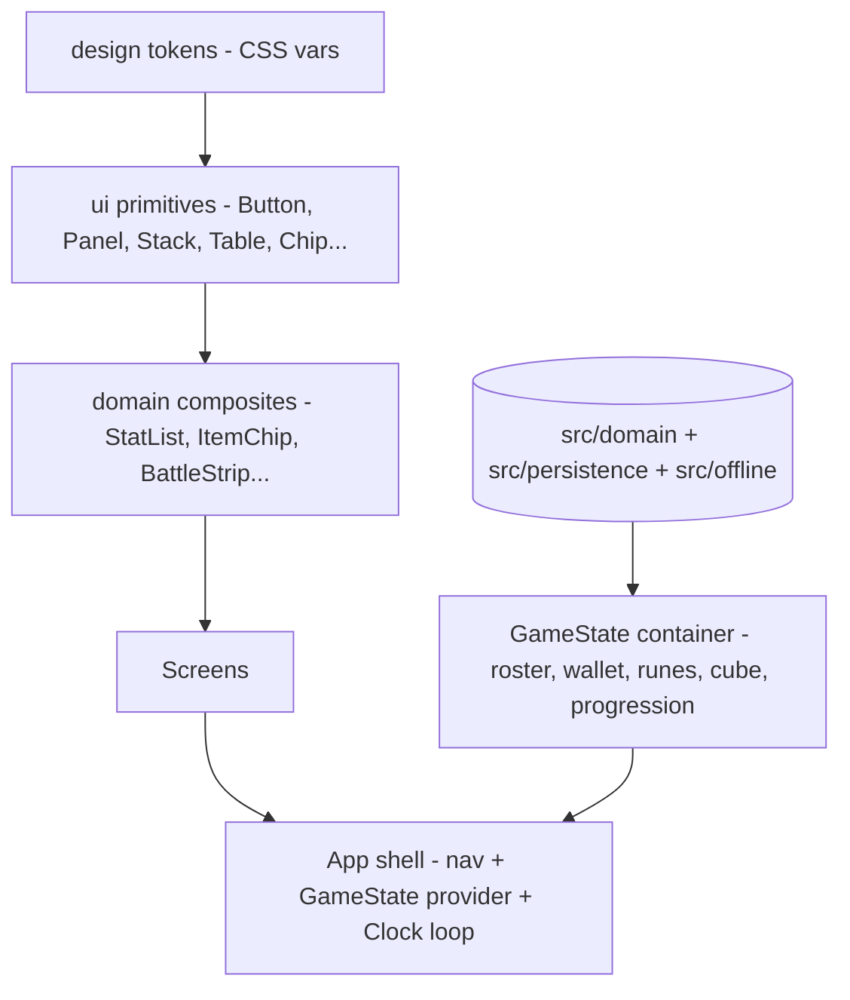
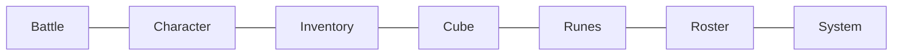

# Minimal UI Test-Harness Plan

> **Scope.** A plan (no code yet) for a **minimal, component-driven UI** whose only job is to
> **exercise and verify the implemented domain systems (M1–M21)** by hand. This is a _test
> harness_, not the shipped game UI — "juice", animation, and art are still deferred
> ([D-016](deferred-decisions-log.md)). It maps every built feature to a screen and a reusable
> component, centralizes all styling, and forbids inline styles / ad-hoc raw HTML.
>
> Authored as a three-role review: **Senior Software Developer**, **Senior Game Designer**,
> **Senior UI/UX Designer**. Read [game-overview.md](game-overview.md) for _what_ the game is and
> [game-implementation-roadmap.md](game-implementation-roadmap.md) for build status.

---

## 1. Team framing — what each role wants from this UI

| Role                   | Primary goal for the harness                                                                                                                                        | Success looks like                                                                                                                    |
| ---------------------- | ------------------------------------------------------------------------------------------------------------------------------------------------------------------- | ------------------------------------------------------------------------------------------------------------------------------------- |
| **Software Developer** | Thin shell over the **pure domain**; zero domain logic in components. Reuse one primitive set. Centralized CSS. No inline styles / raw markup leaking into screens. | Every screen is a composition of named components; the domain is the single source of truth; deleting a screen deletes no game logic. |
| **Game Designer**      | Be able to **drive every system by hand** and read its state: spend skill points, run a battle, roll loot, synthesize in the cube, buy runes, simulate offline.     | I can reproduce any worked example from the overview (gold curve, sell table, smash %, respawn timer) directly on screen.             |
| **UI/UX Designer**     | Mobile-first single column, consistent spacing/typography from **design tokens**, predictable navigation, clear empty/loading/disabled states.                      | One nav, one visual language, no bespoke one-off styles; every interactive element looks and behaves the same everywhere.             |

**Shared non-negotiables (from [copilot-instructions](../.github/copilot-instructions.md) & the locked plan):**
domain purity (UI → domain only, never the reverse), inject `Clock`/`Rng` from the shell, compute-don't-store,
data-not-code. The harness **must not** add game rules — it only renders domain output and calls domain methods.

---

## 2. Goals & non-goals

**Goals**

- One reusable **component primitive library** + a few **domain composites**; screens are pure composition.
- **All CSS centralized** as design tokens + component classes. No inline `style={}`. No raw `<div>/<button>/<table>`
  scattered in screens — they live _inside_ primitives only.
- A screen (or sub-panel) that exercises **each** milestone M1–M21, with the exact anchors from the overview visible.
- A single `Clock`-driven loop in the shell that drives battles, buffs, cooldowns, respawns, and offline catch-up.

**Non-goals (explicitly deferred — log as `D-###` when we build, per repo law)**

- Visual polish / animation / art / sound (`D-016`).
- Responsive multi-column / desktop layout (mobile single-column only).
- Real persistence storage adapter & autosave cadence (`D-036`) — harness uses an in-memory + manual export/import.
- Drag-and-drop reordering juice — reorder via simple up/down controls instead.

---

## 3. Architecture of the shell (Developer view)



**Rules**

- **One state container** (`GameStateProvider`, React context) holds the live domain objects
  (`Roster`, `GroupRoster`, `Wallet`, `RuneState`, cube level, `progression` position, `Inventory`/`Stash`).
  It owns the single `appRng` (seeded in the shell) and the single `Clock`. Screens read from context and call
  domain methods, then trigger a re-render. **No domain object is constructed inside a screen component.**
- **Clock loop** lives once in the shell (a `requestAnimationFrame`/interval that calls `advance(deltaMs)`),
  gated by a global play/pause. Tests of timed systems (battle, buffs, respawn, offline) use a **manual "Advance"**
  control so the designer can step time deterministically.
- **Folder layout (proposed):**
  ```
  src/ui/
    tokens.css            # design tokens only (extends existing index.css vars)
    components.css         # all primitive + composite component classes (centralized)
    primitives/            # Button, Panel, Stack, Row, Grid, Heading, Text, Label,
                           # Table, KeyValueList, Tabs, NavBar, ProgressBar, Badge,
                           # Chip, LogList, EmptyState, Stepper, Counter, Modal
    composites/            # StatList, DerivedStatList, EquipmentSlots, ItemChip,
                           # InventoryGrid, SkillBar, BuildAllocator, BattleStrip,
                           # UnitCard, RuneTreeView, CubeBench, RosterList, GoldBar
    screens/               # BattleScreen, CharacterScreen, InventoryScreen,
                           # CubeScreen, RunesScreen, RosterScreen, SystemScreen
    state/                 # GameStateProvider, useGameState, useClockLoop
  ```
  This keeps `App.tsx` to a nav + provider. The current `App.tsx`/`App.css` content is the **seed**
  for these primitives (its `panel`, `item-chip`, `stats-table`, `next-turn-btn` classes graduate into
  `components.css`).

---

## 4. CSS centralization & "no raw HTML" strategy (UI/UX view)

- **Design tokens** stay in `index.css`/`tokens.css` (`--bg`, `--text`, `--accent`, rarity colors, spacing scale).
  Add a small spacing/size scale (`--space-1..6`, `--radius`, `--font-sm/md/lg`) so components stop using magic px.
- **Every visual decision is a class** in `components.css`, named by component (e.g. `.panel`, `.btn`,
  `.btn--primary`, `.chip`, `.chip--rarity-rare`, `.stack`, `.stack--row`). **No `style={}` anywhere.**
- **No raw HTML in screens.** Screens import primitives. The only place a raw `<button>`/`<div>`/`<table>`
  appears is _inside_ a primitive component file. Enforce with an ESLint rule (e.g. `react/forbid-elements`)
  scoped to `src/ui/screens` and `src/ui/composites`.
- **Variants over new components.** A `Button` takes `variant` (`primary`/`ghost`/`danger`) and `size`; a `Chip`
  takes `rarity`; a `Badge` takes `tone`. This is how we "reuse as much as possible".

---

## 5. Component inventory (reuse-first)

### 5.1 Primitives (generic, zero domain knowledge)

| Component                | Purpose                                     | Key props                                | Reused by                 |
| ------------------------ | ------------------------------------------- | ---------------------------------------- | ------------------------- |
| `Screen`                 | Page wrapper (single column, padding)       | `title`, `children`                      | every screen              |
| `NavBar`                 | Bottom tab nav between screens              | `items`, `active`                        | shell                     |
| `Panel`                  | Titled card section                         | `heading`, `children`                    | every screen              |
| `Stack` / `Row`          | Flex layout (vertical / horizontal, gap)    | `gap`, `align`, `justify`                | everywhere                |
| `Grid`                   | Fixed-column grid (inventory)               | `cols`, `gap`                            | inventory/stash           |
| `Heading`/`Text`/`Label` | Typography                                  | `level`, `tone`                          | everywhere                |
| `Button`                 | Action                                      | `variant`, `size`, `disabled`, `onClick` | everywhere                |
| `Stepper`                | +/- numeric (allocate points, choose qty)   | `value`, `min`, `max`, `onChange`        | build, cube, runes        |
| `Tabs`                   | In-screen tab switch (stash tabs, acts)     | `tabs`, `active`                         | inventory, battle         |
| `KeyValueList`           | Two-column label→value list                 | `rows`                                   | stats, derived, reports   |
| `ProgressBar`            | HP / XP / cube-exp / wave progress          | `value`, `max`, `tone`                   | battle, character, cube   |
| `Badge`                  | Small status pill (rarity, locked, element) | `tone`, `label`                          | items, stages, runes      |
| `Chip`                   | Compact clickable record (one item/skill)   | `rarity`, `onClick`, `children`          | inventory, equip, sockets |
| `LogList`                | Scrolling line log                          | `lines`, `max`                           | battle, offline report    |
| `Counter`                | Icon + number (gold, currency, chest count) | `icon`, `value`                          | top bar, runes, cube      |
| `Timer`                  | mm:ss countdown display                     | `ms`                                     | respawn, offline          |
| `EmptyState`             | "nothing here" placeholder                  | `message`                                | inventory, log, roster    |
| `Modal`                  | Confirm / detail overlay                    | `open`, `onClose`                        | item detail, confirm sell |

### 5.2 Domain composites (thin wrappers that read domain, render primitives)

| Composite         | Wraps / reads                                                                 | Built from primitives            |
| ----------------- | ----------------------------------------------------------------------------- | -------------------------------- |
| `StatList`        | `character.getStat(stat)` over `STATS`                                        | `KeyValueList`                   |
| `DerivedStatList` | `timeBetweenAttacks`, `physicalResist`, `hitDamageFromStats`, `maxHP`         | `KeyValueList`                   |
| `EquipmentSlots`  | `Equipment` + `EQUIPMENT_SLOTS` + `socketLayout`                              | `Panel`, `Chip`, `Badge`         |
| `ItemChip`        | one `Item` (rarity, modifiers, sockets, item level)                           | `Chip`, `Badge`                  |
| `InventoryGrid`   | `Inventory`/`Stash` items + capacity + stacks                                 | `Grid`, `ItemChip`, `EmptyState` |
| `BuildAllocator`  | `Build` + `KNIGHT_PASSIVES` + `KNIGHT_SKILL_NODES` (spend/refund, band locks) | `Panel`, `Stepper`, `Badge`      |
| `SkillBar`        | equipped skills + `CooldownTracker` state                                     | `Row`, `Chip`, `ProgressBar`     |
| `BattleStrip`     | `Battle`/`StageRunner` 1D positions of units                                  | `Row`, `UnitCard`                |
| `UnitCard`        | a `BattleUnit`/`Monster` (HP, respawn, element)                               | `ProgressBar`, `Badge`, `Timer`  |
| `RuneTreeView`    | `RUNE_TREE` + `RuneState` (levels, costs, adjacency)                          | `Panel`, `Stepper`, `Counter`    |
| `CubeBench`       | `synthesize`, `sellValue`, cube exp/level, `THRESHOLDS`                       | `Panel`, `Chip`, `Stepper`       |
| `RosterList`      | `Roster` + `GroupRoster` + formation order                                    | `Panel`, `Chip`, `Stepper`       |
| `GoldBar`         | `Wallet` balance + active currency                                            | `Counter`                        |

---

## 6. Navigation & screens (Game Designer view)

Bottom `NavBar` with 7 tabs (mobile single column). A persistent top **`GoldBar`** shows wallet + chest count.



### S1 — Battle (the core loop) · tests **M9, M10, M11, M12, M13, M14**

- **Stage selector**: act + difficulty `Tabs`, stage `Stepper`; shows monster/item level, allowed elements
  (`Badge`), locked difficulties (`isDifficultyUnlocked`). _Verifies:_ act-1 physical, act-2 fire, hard locked
  until normal cleared.
- **Play / Pause / Advance** buttons drive the `Clock` loop (or step `deltaMs` manually).
- **`BattleStrip`**: the 1D battlefield — party (left) vs spawned monsters (right) as `UnitCard`s with HP bars,
  positions, front-most targeting. _Verifies:_ melee closes distance, ranged stops at range, formation can swap.
- **Wave/boss `ProgressBar`** (`StageRunner`) + **boss-key** indicator (`Badge`, consumed-on-drop rule).
- **`LogList`**: kills, drops (chest rolls via `firstChest`/`openChest`), gold (`goldForKill`), XP split among living.
- **Respawn**: downed `UnitCard` shows a `Timer` (`effectiveRespawnMs`); a "Revive (gold)" `Button`
  (`instantReviveCost`). _Verifies:_ 2-min base, gold cost scales with level, revive-all on stage entry.

### S2 — Character · tests **M1, M3, M4, M6, M7, M8**

- **`StatList`** (canonical stats) + **`DerivedStatList`** (attack interval, physical resist, hit damage, maxHP).
  _Verifies:_ attackSpeed 1.0 → 1000 ms; armor→resist curve anchor; damage-formula worked example.
- **Level + class** header (`KNIGHT`, level, XP `ProgressBar` via `xpRequiredForLevel`).
- **`BuildAllocator`**: passives & skills with `Stepper`, band unlock `Badge`, per-node caps, **refund freely**,
  skill-point counter. _Verifies:_ over-spend blocked, refund restores, band-locked rejected, passive +2/lvl max 10.
- **`SkillBar`**: knight skills (smash/shatter/raise-shield/provoke) with cooldown `ProgressBar` and rank.
  _Verifies:_ smash rank 1 = 200% of basic final damage; raise-shield charges; provoke debuff.
- **Buffs/debuffs `LogList`**: active timed effects with `Timer` (refresh-on-reapply).
- **Training dummy** (reuse current flow): "Attack Dummy" to read a single resolved hit (block/dodge/mitigation).

### S3 — Inventory & Stash · tests **M2, M5, M15, M16**

- **`InventoryGrid`** with capacity counter; full → drops lost (`Badge` warning). Misc stacks; modifiers/boss-keys
  don't (`DEFAULT_STACK_POLICY`).
- **Stash `Tabs`** (multi-tab over same abstraction); `moveItem` between inventory↔stash respecting both caps.
- **Equip** from inventory → `EquipmentSlots`; level-requirement hard block surfaces as disabled + reason.
- **Item detail `Modal`**: base modifiers + **sockets** (`emptySocketsFor`, `applyMaterial`/`extract`,
  `effectiveModifiers`). _Verifies:_ rare = 1 type-1 slot, legendary = 2; applying a material adds its stat.
- **"Generate item"** dev button (`generateItem` with item level) to populate quickly.

### S4 — Cube · tests **M17**

- **`CubeBench`** with three modes (`Tabs`): **Synthesize** (pick N same-rarity/type → fresh next-tier, `SYNTHESIS_RATIO`,
  threshold gate), **Sell** (`sellValue` table), **Level** (cube exp `ProgressBar`, `cubeLevelForExp`, unlocked ops).
  _Verifies:_ 3 commons → 1 fresh uncommon; mismatched type/level rejected; L1 common sells 10g; L10 legendary 6750g.
- **Threshold `Stepper`/Tabs** (`THRESHOLDS`) blocks out-of-range item levels.

### S5 — Runes · tests **M18**

- **`RuneTreeView`**: nodes with per-level `Stepper`, cost growth by depth (`runeCostAt`), adjacency reveal,
  gold spend (`Wallet`). Stat nodes vs perk nodes (inventory cap, stash tabs, respawn reduction, gold/xp/drops).
  _Verifies:_ buying a node raises the global stat/perk; cost scales with depth & level; gold can't go negative.
- A small **"perk readout"** `KeyValueList` showing the live rune-modified values consumed by other screens
  (gold gain, drop chance, inventory cap, respawn reduction, cube exp).

### S6 — Roster · tests **M19**

- **`RosterList`**: owned characters (`Roster`, hero slots) and groups (`GroupRoster`, group slots).
- **Formation order** via up/down `Stepper`/buttons; the order feeds `BattleStrip` positions on S1.
  _Verifies:_ formation order drives battle positions; slot caps enforced. (Acquisition shop is deferred — `D-019`.)

### S7 — System / Dev · tests **M20, M21** + harness controls

- **Save / Load**: `serialize`/`deserialize` round-trip; export/import the `SaveState` JSON in a `Modal`
  (textarea-backed). _Verifies:_ round-trip equality of a populated state.
- **Offline simulate**: pick an elapsed duration → `simulateElapsed`; show the `OfflineReport`
  (gold, xp, chests, capped) in a `KeyValueList` + `LogList`. _Verifies:_ deterministic rewards for fixed time + seed.
- **RNG seed** input (reseed `appRng`) + global **Clock controls** (play/pause/step) for deterministic testing.

---

## 7. Feature → screen → component coverage matrix

| Milestone | Feature                               | Screen(s)            | Key composite(s)                    |
| --------- | ------------------------------------- | -------------------- | ----------------------------------- |
| M1/M4     | Stats + modifiers, rarity scaling     | Character, Inventory | `StatList`, `ItemChip`              |
| M2/M15    | Equip, inventory, stash capacity      | Inventory            | `EquipmentSlots`, `InventoryGrid`   |
| M3        | Consumables + timed buffs             | Character            | buff `LogList`, `Timer`             |
| M5/M14    | Item generation, drop tables, chests  | Inventory, Battle    | `ItemChip`, drop `LogList`          |
| M6        | Canonical stats, damage, mitigation   | Character            | `DerivedStatList`, dummy            |
| M7        | Class, levels, skill points, passives | Character            | `BuildAllocator`                    |
| M8        | Skills (cooldowns, charges, debuffs)  | Character, Battle    | `SkillBar`                          |
| M9/M10    | Monsters + 1D auto-battler            | Battle               | `BattleStrip`, `UnitCard`           |
| M11       | Stages/acts/difficulty/boss keys      | Battle               | stage selector, boss-key `Badge`    |
| M12       | Death & revive                        | Battle               | `UnitCard` `Timer`, revive `Button` |
| M13       | Economy & gold                        | Battle, top bar      | `GoldBar`, gold `LogList`           |
| M16       | Item modifiers / sockets              | Inventory            | item detail `Modal`, sockets        |
| M17       | Cube (synthesis / sell / level)       | Cube                 | `CubeBench`                         |
| M18       | Runes tree                            | Runes                | `RuneTreeView`                      |
| M19       | Roster & groups & formation           | Roster               | `RosterList`                        |
| M20       | Persistence save/load                 | System               | export/import `Modal`               |
| M21       | Offline progress                      | System               | offline report                      |

> Every milestone has at least one on-screen verification path. No milestone is left untestable.

---

## 8. Automated testing strategy (Developer view)

The harness is deliberately **testable, not just manually verifiable**. Because every domain object comes
from the `GameStateProvider` (never constructed inside a component) and time/randomness are **injected**
(`Clock`/`Rng`), tests can build an exact state, render, drive it deterministically, and assert the DOM.

### 8.1 The three test layers

| Layer                         | What it renders                                                                             | What it proves                                                                 | Env        | Speed  |
| ----------------------------- | ------------------------------------------------------------------------------------------- | ------------------------------------------------------------------------------ | ---------- | ------ |
| **Component**                 | one primitive/composite in isolation                                                        | renders props correctly, fires callbacks, variants/disabled states             | `jsdom`    | fast   |
| **Screen integration**        | a full screen wrapped in a **real `GameStateProvider` with real domain objects** (no mocks) | UI + domain together: a user action mutates the domain and the DOM reflects it | `jsdom`    | medium |
| **Flow / domain integration** | no DOM — drive several systems through `GameState`                                          | cross-system loops (kill → gold + xp + chest → open → equip → stat change)     | `node`     | fast   |
| **E2E (optional, few)**       | the real app in a browser                                                                   | full happy-path smoke (play a stage, loot, equip, save/load)                   | Playwright | slow   |

> The middle two layers are the high-value ones. **Screen integration tests are true integration tests**
> precisely because the provider holds the real domain — nothing is stubbed.

### 8.2 Setup (additive, no churn to existing domain tests)

- **Add devDeps:** `jsdom`, `@testing-library/react`, `@testing-library/user-event`, `@testing-library/jest-dom`.
- **Keep domain tests in `node`** (the current 466 stay untouched and millisecond-fast). Run **only** UI tests
  under `jsdom` — either via a per-file `// @vitest-environment jsdom` docblock, or a Vitest **`projects`** split
  (`domain` = node, `ui` = jsdom). _Recommendation:_ `projects` split so `npm run test` covers both, and the
  globs stay declarative instead of relying on per-file docblocks.
- **One setup file** (`src/ui/test/setup.ts`) registers `@testing-library/jest-dom` matchers and `afterEach(cleanup)`.
- **Test utility** (`renderWithGame(ui, { state, rng, clock })`): wraps the UI in a `GameStateProvider` seeded with
  a caller-supplied domain state, a **seeded `Rng`**, and a **manual `Clock`**, and returns the render result plus a
  `step(ms)` helper. This is the single seam every screen test reuses (DRY).

### 8.3 Determinism rules (mirror the domain laws)

- Tests **inject a seeded `Rng`** — never rely on `appRng`/`Date.now()`. Loot rolls, block/dodge, drops are reproducible.
- Tests **step the `Clock` manually** (`step(1000)`), never `setTimeout`/real `requestAnimationFrame`. The clock loop
  is disabled in tests; the manual "Advance" path is what's exercised. No `await`-ing wall-clock time.
- **Assert on accessible output** (text/role), not CSS classes — keeps tests resilient to the centralized-CSS refactors.

### 8.4 Representative integration tests per screen

| Screen    | Integration assertion (real provider, seeded rng, stepped clock)                                                                                                                      |
| --------- | ------------------------------------------------------------------------------------------------------------------------------------------------------------------------------------- |
| Character | spend a skill point on "+attack" passive → `StatList` attack value increases; refund → reverts; band-locked node's `Stepper` is disabled                                              |
| Character | "Attack Dummy" with a seeded rng → a deterministic damage line appears in the `LogList`; dodge case produces the dodge line                                                           |
| Inventory | equip an item below level req → button disabled w/ reason; equip a valid item → moves to `EquipmentSlots`, stat updates; apply a material in the detail `Modal` → socket stat appears |
| Battle    | press Play then `step(ms)` → monsters advance, front-most takes damage, a kill emits gold (`GoldBar` rises) + an XP/chest log line; party wipe → drop one stage                       |
| Battle    | down a unit → respawn `Timer` shows; `step` past it → unit returns; "Revive (gold)" spends the right `instantReviveCost`                                                              |
| Cube      | select 3 same-rarity/type items → Synthesize → one fresh next-tier `ItemChip` appears; mismatched tier blocked; Sell shows the overview's gold value                                  |
| Runes     | buy a stat node → global stat in the perk readout rises and gold drops by `runeCostAt`; insufficient gold disables the buy                                                            |
| Roster    | reorder formation → the order drives `BattleStrip` unit positions on the Battle screen                                                                                                |
| System    | export `SaveState`, reset, import → state round-trips (roster/inventory/wallet/progression equal); run offline sim for a fixed elapsed+seed → deterministic `OfflineReport` numbers   |

### 8.5 What stays out of UI tests (test it in the domain instead)

Formulas and balance (damage numbers, sell table, respawn ms, gold curve, synthesis ratio) are **already**
asserted by domain tests — UI tests should **not** re-assert the math (DRY). UI tests assert only that the
screen **wires the action to the right domain call and renders the result**. This keeps the UI suite small and
resistant to balance re-tuning.

---

## 9. Build order (smallest reusable slice first)

1. **Foundation:** `tokens.css` + `components.css`; primitives (`Screen`, `Panel`, `Stack`, `Row`, `Grid`,
   `Heading`/`Text`/`Label`, `Button`, `KeyValueList`, `Badge`, `Chip`, `EmptyState`). Migrate current `App.css`
   classes into `components.css`. Add the ESLint `forbid-elements` guard for screens/composites.
2. **Test harness setup:** add `jsdom` + Testing Library devDeps, the Vitest `projects` split, `setup.ts`, and the
   `renderWithGame` utility (§8.2) — so every later step is built test-first.
3. **State shell:** `GameStateProvider` + `useGameState` + `useClockLoop`; `NavBar`; empty screen scaffolds.
4. **Character + Inventory** screens (reuse most primitives; highest feature density: M1–M8, M15–M16).
5. **Battle** screen (`BattleStrip`, `UnitCard`, stage selector, clock loop): M9–M14.
6. **Cube + Runes** screens: M17–M18.
7. **Roster + System** screens: M19–M21.

Each step ends in a screen that is both **manually verifiable** and **covered by a screen integration test**; no
step adds domain logic.

---

## 10. Open questions to confirm before building

1. **Routing:** in-memory tab state (no router dep) vs. `react-router`? _Recommendation:_ in-memory tab state —
   minimal, no dependency, single-column harness doesn't need URLs.
2. **Re-render strategy:** keep the current `forceUpdate` reducer pattern in the provider, or move live domain
   objects into a versioned snapshot? _Recommendation:_ provider holds objects + a `version` counter bumped on any
   mutation; screens read via `useGameState()` — preserves "compute-don't-store" and avoids cloning domain.
3. **Lint enforcement:** add `react/forbid-elements` (raw `button`/`div`/`table`) only under `src/ui/screens` +
   `src/ui/composites`, allowing them inside `src/ui/primitives`. Confirm we want CI to fail on violations.
4. **Clock unit in UI:** confirm the loop advances in **ms** (matches the locked `Clock` unit) and that the manual
   "Advance" stepper uses ms increments (e.g. 100 ms / 1 s / 1 min presets).
5. **Test env split:** confirm Vitest **`projects`** (node `domain` + jsdom `ui`) over per-file docblocks, and
   whether E2E (Playwright) smoke tests are in scope now or deferred.

## 11. Deferrals to log when this UI is built (per repo law)

Append to [deferred-decisions-log.md](deferred-decisions-log.md) when reached: battle visuals/animation/art
(extends **D-016**), real storage adapter + autosave for the System screen (**D-036**), character/group acquisition
shop UI (**D-019**), and any new **D-###** for harness-only shortcuts we replace later (e.g. textarea save import,
up/down formation reorder standing in for drag-and-drop).

```

```
